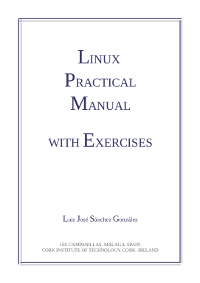

# Programación de 1º DAW y 1º DAM

Este documento es la guía de la asignatura **Programación** de 1er curso del Ciclo Formativo de Grado Superior de **DAW** (Desarrollo de Aplicaciones Web) y de **DAM** (Desarrollo de Aplicaciones Multiplataforma) impartido en las instalaciones del **Parque Tecnológico de Andalucía** del centro educativo **IES Campanillas** (Málaga). Los profesores son **Juan Antonio Jiménez** y **Luis José Sánchez**.

## Índice

* [Bibliografía](#bibliografía)
* [Ejemplos y soluciones a los ejercicios](#ejemplos-y-soluciones-a-los-ejercicios)
* [Máquinas virtuales](#máquinas-virtuales)
* [Enlaces](#enlaces)

## Bibliografía

[Aprende Java con Ejercicios](https://leanpub.com/aprendejava/)

[Git y GitHub - Guía de Supervivencia](https://leanpub.com/gitygithub/)

[Linux Practical Manual with Exercises](linux_practical_manual_31_07_2014_en.pdf)

[Advanced Bash-Scripting Guide - Mendel Cooper](abs-guide.pdf)

[Programación en Bash](manualbash.pdf)

## Ejemplos y soluciones a los ejercicios

<https://github.com/LuisJoseSanchez/aprende-java-con-ejercicios>

## Actividad "Aprende un lenguaje en un día"

<https://github.com/LuisJoseSanchez/aprende-un-lenguaje-en-un-dia>

## Máquinas Virtuales

[Descarga de **Virtual Box** y de **Virtual Box Extension Pack**](https://www.virtualbox.org/wiki/Downloads)

[Debian 9 con JDK 14, PSeInt y Geany](https://drive.google.com/file/d/1G-wxOEAei7vV1BnH4ZRx1-_Aw2q62Nb3/view?usp=sharing) - Actualizado 18/10/2021

[Ubuntu 20.04.1 con JDK 14, PSeInt, Geany, Netbeans, Eclipse, Zsh, Oh my Zsh!, PowerLevel10K](https://drive.google.com/file/d/1vludVg0f0UXnL-93n8KqnujCfhcLCXz3/view?usp=sharing) - Actualizado 23/09/2020

<!--

[Descarga de la máquina virtual SliTaz GNU/Linux con JDK y Geany](https://drive.google.com/file/d/121XIj5k1UHqBkSlHsVgp4Tu1gs118W2N/view?usp=sharing) -  Actualizado 27/10/2018

[Descarga de la máquina virtual SliTaz GNU/Linux con JDK y Geany + Firefox](https://drive.google.com/file/d/1WKhEUU_2vZVtaoO6_h5xFGJRg5nEj2Uf/view?usp=sharing) -  Actualizado 22/09/2020

[Descarga de la máquina virtual SliTaz GNU/Linux con JDK y Geany, con soporte para gráficos OpenGL y sonido Intel](https://drive.google.com/file/d/1CuwzHvOz0XFY6N21ydJ9PQjYBnUy0e6t/view?usp=sharing) -  Actualizado 19/12/2019

[Descarga de la máquina virtual SliTaz GNU/Linux con JDK, Geany y NetBeans](https://drive.google.com/file/d/1Hyx2367Ti5x4AhXCuwZtsxJUUEwLLsZd/view?usp=sharing) -  Actualizado 15/11/2018

[Descarga de la máquina virtual SliTaz GNU/Linux con JDK, Geany y NetBeans - Soporte para JSP con MySQL+phpmyadmin](https://drive.google.com/file/d/18Aj4cNe0TqUvK-40BTAiIqh0Ua6_WlEV/view?usp=sharing) -  Actualizado 15/02/2019

[Descarga de la máquina virtual SliTaz GNU/Linux con JDK, Geany y Eclipse](https://drive.google.com/file/d/1HrQ-RDJn75dLwaPIhfKoVs8HoMWK5a14/view?usp=sharing) -  Actualizado 15/11/2018

[Descarga de la máquina virtual SliTaz GNU/Linux con JDK, Geany e IntelliJ](https://drive.google.com/file/d/1gyHm8TNayiO1xWM0fyrx_VH1n4YaVCC_/view?usp=sharing) -  Actualizado 14/11/2019

[Descarga de la máquina virtual SliTaz GNU/Linux con JDK, Geany y NetBeans - Soporte para JSP con MariaDB+phpmyadmin](https://drive.google.com/file/d/1jVuPjAl_JzEy1z2NhQ2cMDuDocbenMco/view?usp=sharing) -  Actualizado 17/05/2020

-->

## Enlaces

[IES Campanillas (web oficial)](http://iescampanillas.com/)

[Índice de contenidos para los CFGS del IES Campanillas](https://github.com/IESCampanillas/indice-dam-y-daw)

:star: Si te ha gustado este repo, dale una estrellita :wink:
